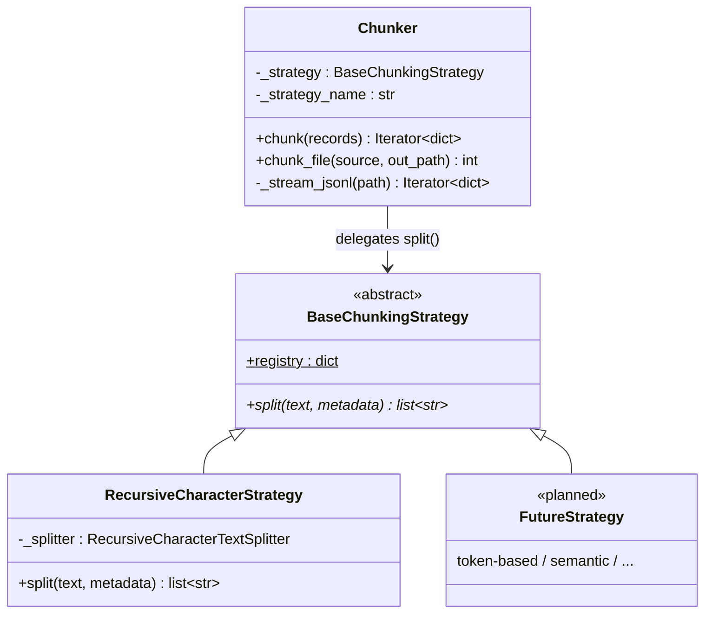
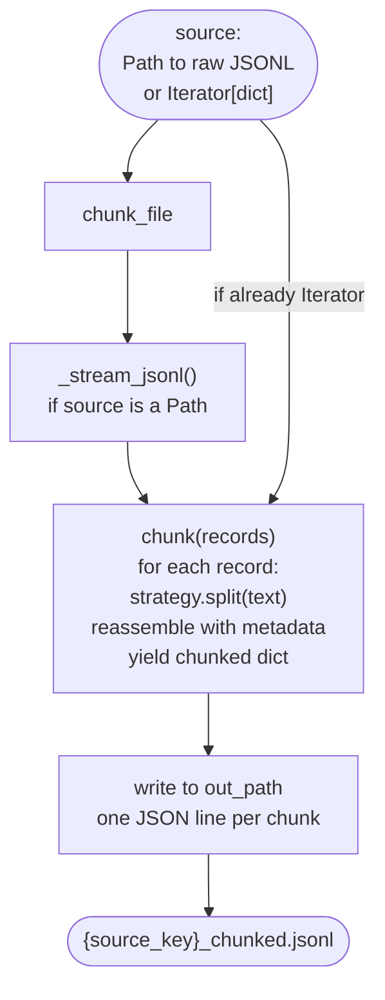

# Chunking — Architecture

Implementation details for the chunking stage. For design decisions and
the overall pipeline shape, see [`design/ingestion-pipeline.md`](../ingestion-pipeline.md).

---

## 1. Design Concept

The chunking stage uses a **strategy pattern**: `Chunker` owns record
assembly — iterating records, calling `split()`, and reassembling metadata
around each chunk. The text splitting algorithm itself is delegated to a
`BaseChunkingStrategy` subclass, which `Chunker` calls but does not
control.

This separation means adding a new splitting algorithm requires no changes
to `Chunker` — only a new subclass in `strategies.py`. Subclasses are
auto-registered via `__init_subclass__`, so no manual registry update is
needed either.

---

## 2. Class Structure

`Chunker` owns record iteration, metadata assembly, and file I/O.
`BaseChunkingStrategy` subclasses own only the text splitting algorithm
(the `split()` method, shown in italic). `Chunker` selects a strategy at
construction time via the registry.



`chunk()` is a pure generator — no file I/O. `chunk_file()` is the entry
point the orchestrator calls: it accepts either a `Path` (file mode —
reads raw JSONL) or an `Iterator[dict]` (streaming mode — receives records
directly from `scraper.stream()`), then iterates `chunk()` and writes
each chunked record to `out_path`.



---

## 3. Config

Each source YAML carries its own `chunking:` section:

```yaml
chunking:
  strategy: recursive_character
  params:
    chunk_size: 1000
    chunk_overlap: 200
```

`strategy` maps to a key in `BaseChunkingStrategy.registry`. The key is
derived from the class name: snake_case with the `_strategy` suffix
stripped (e.g. `RecursiveCharacterStrategy` → `recursive_character`).
`params` is passed as a raw dict to the strategy constructor — each
strategy validates its own params.

`Chunker` reads the `chunking` key from the full source config dict:

```python
chunker = Chunker(
    config
)  # config["chunking"]["strategy"] selects the strategy
```

---

## 4. Adding a New Strategy

1. Add a subclass of `BaseChunkingStrategy` in `strategies.py`
2. Implement `split(text, metadata=None) -> list[str]`
3. Registration is automatic — no other files need to change

`metadata` is available for strategies that need document context (e.g.
choosing separators based on document type). The current
`RecursiveCharacterStrategy` ignores it.
