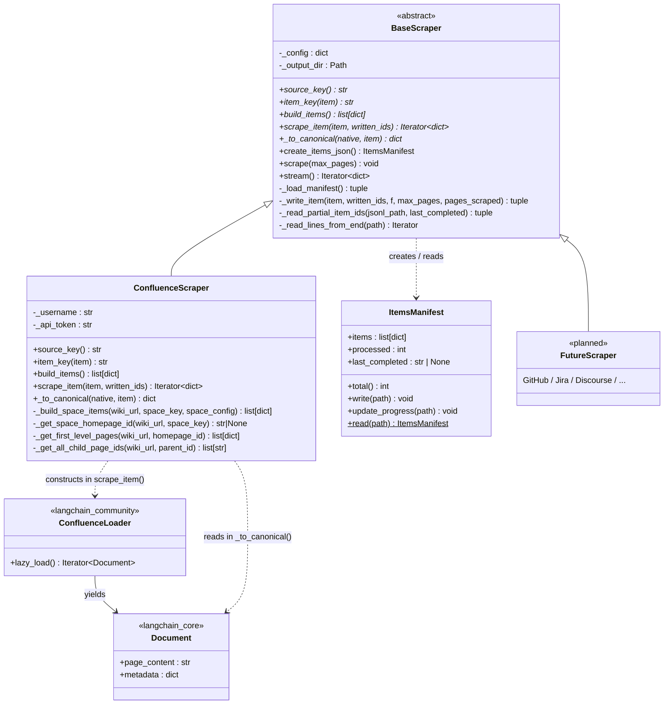
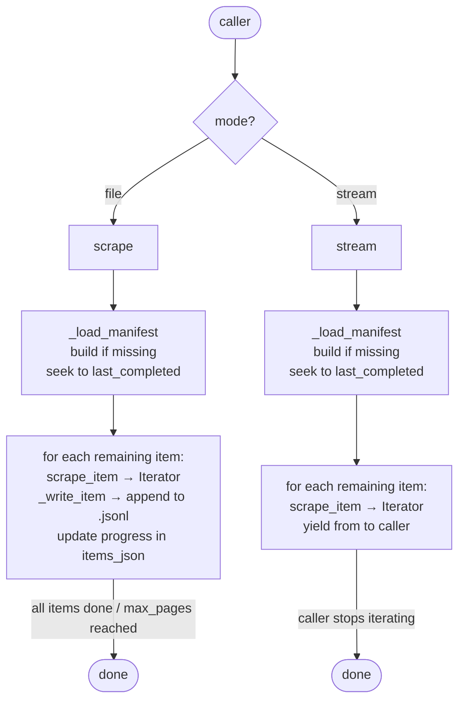
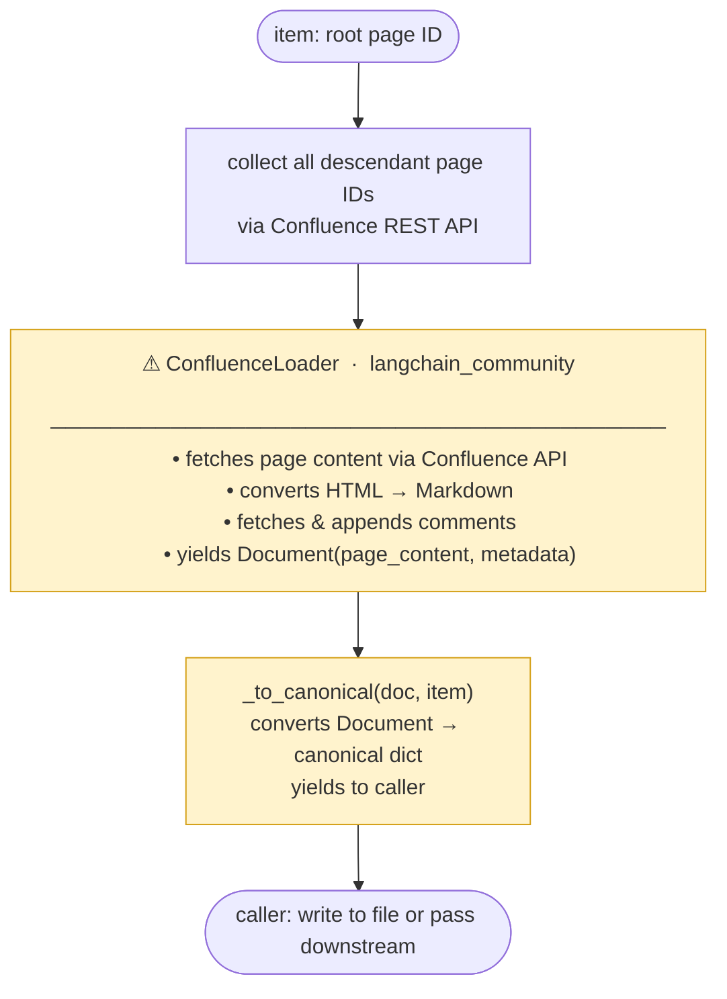
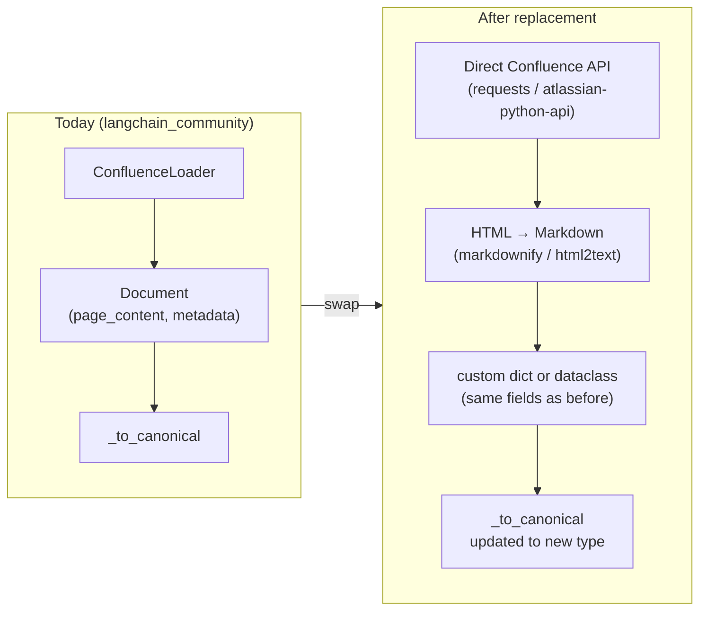

# Scrapers — Architecture

Implementation details for the scraper stage. For design decisions and
the overall pipeline shape, see [`design/ingestion-pipeline.md`](../ingestion-pipeline.md).

---

## 1. Two-Phase Design

Every scraper separates enumeration from content fetching into two phases
with distinct responsibilities. This keeps the item list stable across
interrupted runs and makes resume logic simple.

**Phase 1 — enumerate items** (`build_items` / `create_items_json`):

Discovers what to scrape and writes `{source_key}_items.json`. No content
is fetched. The item list is the unit of resume tracking — each item is
marked complete only after all its records are written. The definition of item is data source dependent.

**Phase 2 — fetch content** (`scrape_item`):

Given one item, fetches its content from the source, converts each native
object to a canonical dict via `_to_canonical()`, and yields the results.
No file writing, no mode awareness — the caller decides what to do with
each yielded record.

The split means Phase 1 can be re-run cheaply to refresh the item list
without touching any scraped content, and Phase 2 can be driven by either
`scrape()` (file mode) or `stream()` (streaming mode) without changes.

---

## 2. Class Structure

`BaseScraper` owns manifest management, resume logic, and the scraping
loop. Each data source implements five abstract methods (shown in italic);
everything else is inherited. The two public entry points for scraping are
`scrape()` (file mode — writes to `{source_key}.jsonl`, updates manifest)
and `stream()` (streaming mode — lazy generator, no file written).



Both entry points share the same manifest loop — the difference is what
happens to each yielded record. `scrape()` writes it to disk and updates
progress; `stream()` yields it upstream. `max_pages` caps the total pages
written in a `scrape()` run: when reached, progress is saved and the next
call resumes from that point.



---

## 3. Confluence Scraper

### `build_items()` — what is an item for this data source?

An **item** is one first-level page under a space homepage. It is the root of
a page tree that `scrape_item()` will fully scrape — the root page plus all
its descendants.

`confluence_sources.yaml` defines which wikis and spaces to include.
`build_items()` expands that config into a flat item list written to
`confluence_items.json`:

```
confluence_sources.yaml                  →   confluence_items.json
──────────────────────────────────────       ──────────────────────────────────────
wiki: lsst.atlassian.net                     items:
  space: DM                            →       - { space_key: DM, id: "111" }
    (auto: first-level child pages)            - { space_key: DM, id: "222" }
                                               - { space_key: DM, id: "333" }
  space: SE                            →       - { space_key: SE, id: "42"  }
    pages: [42, 99]  (explicit)                - { space_key: SE, id: "99"  }
```

If `pages:` is listed explicitly under a space, those IDs become items
directly — skipping the homepage lookup.

### `scrape_item()` — fetch content

`scrape_item()` is a generator — it yields one canonical dict per page
and does no file writing. The caller (`scrape()` or `stream()`) decides
what to do with each yielded record.



---

## 4. Output Files

| File | Written by | Purpose |
|---|---|---|
| `confluence_items.json` | `create_items_json()` | Full item list + progress state |
| `confluence.jsonl` | `scrape()` via `_write_item()` | Scraped documents, one JSON record per line. Only written in file mode — not in streaming mode. |

---

## 5. LangChain Dependency — Scope and Replacement

### What `ConfluenceLoader` currently does

`langchain_community.document_loaders.ConfluenceLoader` is used in a single
method: `ConfluenceScraper.scrape_item()`. It handles three things that would
otherwise need custom code:

| Responsibility | Detail |
|---|---|
| HTTP fetching | Calls Confluence REST API for each page ID, with retry logic |
| HTML → Markdown | Converts Confluence storage format to Markdown text |
| Comment fetching | Fetches and appends inline comments to the page text |

It yields `Document` objects consumed immediately by `_to_canonical()`,
which reads `doc.page_content` (the Markdown text) and `doc.metadata` (keys:
`id`, `title`, `source`, `when_edited`).

### Isolation boundary

The LangChain coupling is confined to two methods in `ConfluenceScraper`:

```
scrape_item()     ← constructs ConfluenceLoader, iterates lazy_load()
_to_canonical()   ← reads Document.page_content and Document.metadata
```

`BaseScraper` and `ItemsManifest` have **zero** LangChain dependency. All
orchestration, resume logic, and file I/O are unaffected by any loader change.

### What a replacement would look like



**Files that change:** only `scrape_confluence.py`
**Files that do not change:** `base.py`, `ItemsManifest`, all future scrapers

### Work estimate

| Task | Notes |
|---|---|
| Replace HTTP fetching | Use `requests` directly (already used in `build_items`) or `atlassian-python-api` |
| Replace HTML → Markdown | `markdownify` or `html2text` are drop-in libraries |
| Replace comment fetching | One extra REST call per page: `GET /rest/api/content/{id}/child/comment` |
| Update `_to_canonical` | Accept the new type; field names are the same |
| Remove `langchain_community` dep | Edit `pyproject.toml` / `requirements.txt` |

> **Main risk:** `ConfluenceLoader`'s HTML→Markdown output is what the RAG
> system has been tuned against. Switching converters may change how content
> is chunked and embedded, which can silently affect retrieval quality. A
> side-by-side output comparison on a sample of pages is recommended before
> switching in production.
